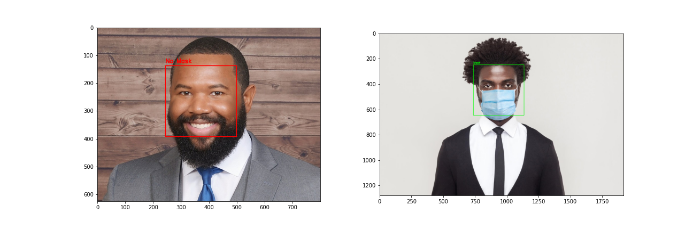

# Facial Mask Detection

In this project we implement a [facial mask classifier](https://nbviewer.jupyter.org/github/diogolbar/mask-detection/blob/main/MaskClassifier.ipynb) using a pre-trained model ([MobileNetV2](https://www.tensorflow.org/api_docs/python/tf/keras/applications/MobileNetV2)) and a convolutional neural network. With [OpenCV](https://nbviewer.jupyter.org/github/diogolbar/mask-detection/blob/main/FaceMaskRecog.ipynb) we also made possible for this classification to have a visual result as showed bellow:

where we used a green rectangle to represent a mask detection and a red one when no mask is detected. The code also displays the text "Mask" or "No Mask" and what is the percentage that the algorithm based it's decision on. This project is still under development, not only for better detection (some faces and masks are not detected) but we also want to use the same model to detect if someone is using a mask or not using a webcam.

Data Source: [Kaggle](https://www.kaggle.com/ashishjangra27/face-mask-12k-images-dataset)
 
