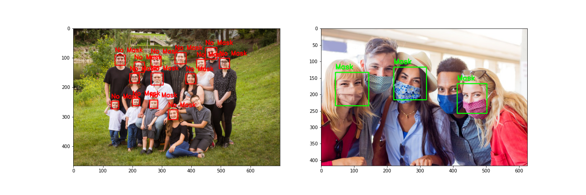

# Facial Mask Detection

In this project we implement a [facial mask classifier](https://nbviewer.jupyter.org/github/diogolbar/mask-detection/blob/main/MaskClassifier.ipynb) using a neural network. With [OpenCV](https://nbviewer.jupyter.org/github/diogolbar/mask-detection/blob/main/FaceMaskRecog.ipynb) we also made possible for this classification to have a visual result as showed bellow:

where we used a green rectangle to represent a mask detection and a red one when no mask is detected. The code also displays the text "Mask" or "No Mask" and what is the percentage that the algorithm based it's decision on. This project is still under development, we want to use the same NN model to detect on a webcam if someone is using a mask or not.

Data Source: [Kaggle](https://www.kaggle.com/ashishjangra27/face-mask-12k-images-dataset)
 
